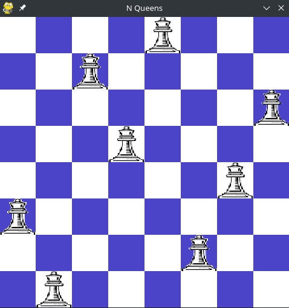

# Problema das N-Rainhas utilizando Busca Tabu

Este algoritmo foi desenvolvido para resolver o famoso "Problema das N-Rainhas" utilizando a técnica de busca tabu. O objetivo é encontrar uma disposição das rainhas em um tabuleiro de xadrez de N x N que não se ataquem mutuamente.

## Instalação

Antes de executar o programa, é necessário instalar a biblioteca Pygame. Realize a instalação utilizando o `pip`, o gerenciador de pacotes Python. Certifique-se de que você tem o Python instalado em seu sistema. Em seguida, siga estas etapas:

1. Abra o terminal ou prompt de comando. Ative seu ambiente virtual se desejar.

2. Execute o seguinte comando para instalar o Pygame:

   ```bash
   pip install pygame
   ```

## Execução do Programa

1. Rode o programa via terminal e informe os seguintes argumentos:
    ```bash
    python main.py <max_iter> <qtd_rainhas> <tam_lista_tabu>
    ```
2. Exemplo, para resolver o problema com um limite de 100 iterações 8 rainhas e tempo tabu de 5, rode o seguinte comando:

    ```bash
    python main.py 100 8 5
    ```

<div align="center">
  
</div>

